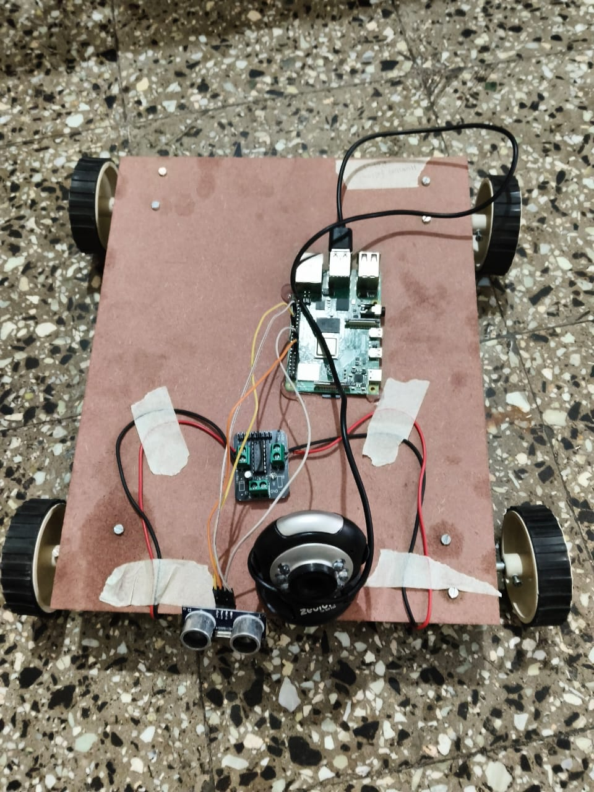

# Voice-Activated Human-Following Robot Using Computer Vision



## 🔍 Project Overview

This project is a voice-activated human-following robot built using a Raspberry Pi, webcam, ultrasonic sensor, and motor driver. It uses computer vision for human detection and voice commands for control.

## 🧠 Key Components
- Raspberry Pi 4
- Webcam
- Ultrasonic Sensor
- L298N Motor Driver
- 4-Wheel Chassis
- Python + OpenCV + Speech Recognition

## 🛠 Features
- Voice-controlled navigation
- Human detection and tracking using deep learning
- Obstacle avoidance using ultrasonic sensors

## 📂 How to Run
1. Clone the repo:
   ```bash
   git clone https://github.com/suyash456/Voice-Activated-Human-Following-Robot-Using-Computer-Vision.git
   cd Voice-Activated-Human-Following-Robot-Using-Computer-Vision
